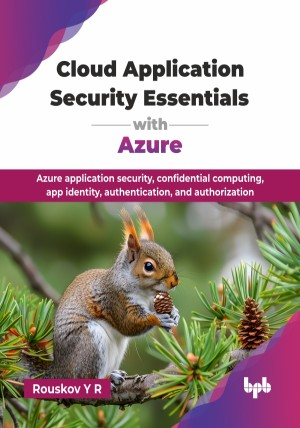

# Cloud Application Security Essentials with Azure

Azure application security, confidential computing, app identity, authentication, and authorization.

This is the repository for [Cloud Application Security Essentials with Azure
](https://bpbonline.com/products/cloud-application-security-essentials-with-azure?_pos=1&_sid=821a43a2d&_ss=r&variant=44718934950088?variant=44718934950088),published by BPB Publications.

## About the Book
Modern application development is deeply intertwined with cloud computing, making robust application security an absolute imperative for every professional. As applications increasingly leverage cloud components and services like Azure, understanding the security implications for both your app architecture and its underlying platform is critical to prevent breaches and ensure system integrity. 

This book starts by defining modern app security, outlining crucial security assertions and security metrics for cloud environments. It then dives into different clouds, including private vs. public cloud models and their impact on app security requirements, highlighting Azure examples and confidential computing. You will explore fundamental blockchain concepts and their relevance, then master app identity, app keys, and delegation concepts. This book aims to define metrics to help evaluate the application security level and establish security as a feature of the application.

Upon completing this book, you will possess a strong foundational and practical understanding of how to secure modern applications across diverse cloud landscapes. You will be well-prepared to design, implement, and maintain secure applications, effectively mitigating risks and contributing confidently to your organization's cloud security posture, and evaluate it in other cases.

## What You Will Learn
• Explore common concepts related to security – using private clouds, encryption, authorization, etc. 

• Define modern app security assertions, architecture, and cloud metrics.

• Implement cloud app identity, app keys, and delegation securely.

• Integrate app architectures, cloud services, and blockchain for security

• Apply robust data encryption, Azure support, and secure key access.

• Understand app monetization, blockchain economics, and security implications.
